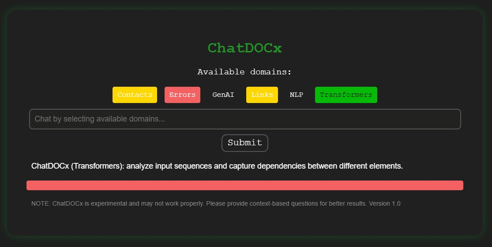

# ChatDOCx

### A chatbot powered by Hugging Face and Python

- Chat with your documents by asking questions on a user friendly web app.
- Summarize your documents.
- Too many links or contacts? Access them easily.
- Create your own custom domain e.g., development errors you would like to trace.
- Supports different NLP models from Hugging Face.

Here is an example where the bot answers a sample question on transformers:

<div align="center">
    
</div>

> NOTE: ChatDOCx is experimental and may not work properly. Please provide context-based questions for better results.

--- 

## Table of Contents

* [Simple Theory](#simple-theory)
    - [NLP](#NLP)
    - [Transformers](#transformers)
* [Running the chatbot](#running-the-chatbot)
    - [Install the dependencies](#install-the-dependencies)
    - [Run the web app](#run-the-web-app)
* [Features](#features)
    - [Models](#models)
    - [Customization](#customization)
    - [Error handling](#error-handling)
* [References](#references)

---

## Simple Theory

### NLP

- TBD

### Transformers

- TBD

---

## Running the chatbot

### Install the dependencies

First up, install all the required Python dependencies by running: ```
pip install -r requirements.txt ```

> NOTE: Development environment is Windows/Python version 3.11.3 (there can always be version conflicts between the dependencies, OS, hardware etc.).

### Run the web app

The web application is powered by Flask, run it with: ```python nlp.py```. In the command window, you should see something like WARNING: This is a development server. Do not use it in a production deployment.

 * Running on http:/100.0.1.0:8000

Which is your web adress (just copy paste it in your browser to access the app).

---

## Features

The following features can be easily enabled/disabled in ```mylib/config.json```:

```json
{
    "model_name": "deepset/roberta-base-squad2",
    "summary_model_name": "facebook/bart-large-cnn",
    "app_name": "",
    "use_stopwords": true
}
```

### Models

- TBD

### Customization

- TBD

### Error handling

- TBD

---

## References

- Hugging Face Question Answering models: https://huggingface.co/models?pipeline_tag=question-answering&sort=trending
- Hugging Face Summarization models: https://huggingface.co/models?pipeline_tag=summarization&sort=trending
---

*saimj7/ 14-04-2024 - © <a href="http://saimj7.github.io" target="_blank">Sai_Mj</a>.*
